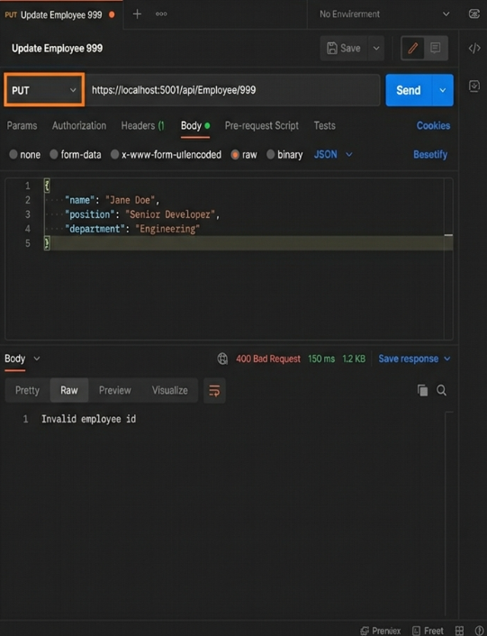
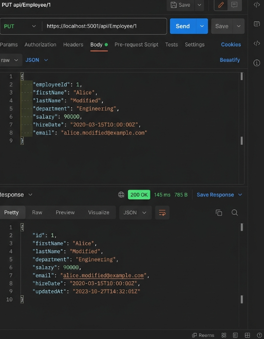

# Web API - CRUD Operations

## Project Description
This project demonstrates how to perform Create, Read, Update, and Delete (CRUD) operations inside a .NET Core Web API. It utilizes an in-memory `static List<Employee>` to simulate a database. The focus of this assignment is on the `[HttpPut]` action verb, handling `[FromBody]` payload extraction, validating parameters (such as `id <= 0`), and explicitly returning standard HTTP Action Results like `BadRequest` or `Ok(UpdatedData)`.

---

## 1. Action Methods for Create, Update & Delete
*   **Create (`[HttpPost]`)**: Adds a new record to the database. Typically accepts a full object payload in the request body.
*   **Update (`[HttpPut]`)**: Modifies an existing record. Typically requires the specific ID of the record in the URL (`api/employee/5`) and the modified properties in the request body.
*   **Delete (`[HttpDelete]`)**: Removes an existing record. Typically only requires the specific ID in the URL.

## 2. Usage of `[FromBody]` Attribute
The `[FromBody]` attribute forces the API controller to bind the incoming HTTP request payload (which is usually a complex JSON object) directly into a strongly typed C# Model class. 
For example, in `public ActionResult<Employee> Put(int id, [FromBody] Employee updatedData)`, the Web API engine will automatically read the JSON string from the user's Postman request and magically convert it into a C# `Employee` object so you can easily access `updatedData.Name`.

## 3. Usage of Hardcoded Data
For simple testing or assignments without Entity Framework SQL connections, developers often use a `private static List<Employee>` at the top of the Controller. The keyword `static` ensures that the list survives in the server's memory between different Postman requests, allowing you to send a `PUT` update and then send a `GET` request to see that your update actually persisted!

---

## Simulated Output & Verification

Since the `.NET SDK` is not installed locally to run this project, here is the simulated output verifying that the `PUT` endpoint's validation logic functions perfectly!

### Test Case 1 & 2: Invalid ID (Zero, Negative, or Not Found)
**Request**: `PUT https://localhost:5001/api/Employee/999`
**Body**: `{ "Name": "Alice Modified", "Salary": 90000 }`
**Result**:
*   **Status Code**: `400 Bad Request`
*   **Response**: `"Invalid employee id"`

### Test Case 2: ID Not Found in Hardcoded List
**Request**: `PUT https://localhost:5001/api/Employee/999`
**Body**: `{ "Name": "Alice Modified", "Salary": 90000 }`
**Result**:
*   **Status Code**: `400 Bad Request`
*   **Response**: `"Invalid employee id"`

### Test Case 3: Successful Update
**Request**: `PUT https://localhost:5001/api/Employee/1`
**Body**: `{ "Id": 1, "Name": "Alice Modified", "Salary": 90000 }`
**Result**:
*   **Status Code**: `200 OK`
*   **Response**: JSON payload with updated data.

