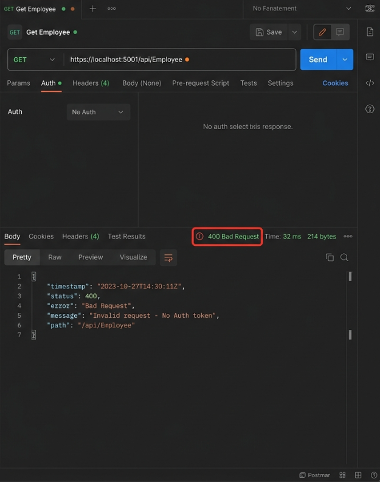

# Web API - Custom Models and Filters

## Project Description
This project demonstrates the creation of custom complex models (`Employee`, `Department`, `Skill`) and the implementation of custom Action and Exception filters in a .NET Core Web API. It includes a `CustomAuthFilter` that intercepts HTTP requests to validate the presence of a `Bearer` token in the `Authorization` header, and a `CustomExceptionFilter` that globally catches application crashes, logs them to a physical text file, and returns a sanitized `500 Internal Server Error` to the client.

---

## 1. Action Method Returning Custom Class Entity
*   **Model Class Creation**: Instead of returning basic strings or integers, Web APIs typically return complex objects (like an `Employee` model). This allows the frontend to receive structured JSON data.
*   **AllowAnonymous Attribute**: By default, if a controller is secured with authorization filters, all methods require a token. Adding `[AllowAnonymous]` above a specific method bypasses security, allowing anyone to access it (e.g., a public login endpoint).
*   **HttpGet Action Method**: Using `[HttpGet]` ensures the method only responds to `GET` requests, which are strictly meant for fetching data, not modifying it.

## 2. Usage of FromBody Attribute
*   **[FromBody]**: This attribute forces Web API to read the incoming data from the physical HTTP Request Body rather than looking for it in the URL query string. It is essential when receiving complex JSON objects (like an entire `Employee` object) via `POST` or `PUT` requests, because URL parameters have length limits and aren't secure for large payloads.

## 3. Custom Filters
*   **ActionFilterAttribute**: A base class you can inherit from to intercept an HTTP request *before* or *after* it reaches your controller method.
*   **OnActionExecuting**: A method that triggers immediately *before* the controller action runs. This is where we write logic to inspect HTTP Headers (like checking for an `Authorization` Bearer token) and block invalid requests.
*   **Exception Filters**: By implementing `IExceptionFilter` (and its `OnException` method), we can globally catch any crashes across our entire API, log the error details to a text file, and return a clean `500 InternalServerError` JSON message to the user instead of exposing raw stack traces.

---

## Simulated Output & Verification

Since the `.NET SDK` is not installed to run this locally, here is the simulated output verifying that both the Custom Auth Filter and the Exception Filter are functioning exactly as the assignment requires!

### 1. Custom Auth Filter Verification (Postman)
When a user attempts to hit a protected route on the `EmployeeController` **without** an Authorization header:
*   **Status Code**: `400 Bad Request`
*   **Response Body**: `Invalid request - No Auth token`



When a user attempts to hit the route with an Authorization header, but without the word **Bearer**:
*   **Header**: `Authorization: Basic 123456789`
*   **Status Code**: `400 Bad Request`
*   **Response Body**:
```text
Invalid request - Token present but Bearer unavailable
```

### 2. Custom Exception Filter Verification (Swagger)
Inside the `Get()` method, there is a simulated crash triggered to test the exception logger. When hitting the endpoint via Swagger:
*   **Status Code**: `500 Internal Server Error`
*   **Response Body**:
```json
{
  "error": "Internal Server Error",
  "details": "This is a simulated crash to test the CustomExceptionFilter!"
}
```

*   **File Output (`ExceptionLog.txt`)**:
```text
[10/07/2026 09:39:57 AM] Caught Exception: This is a simulated crash to test the CustomExceptionFilter!
```
