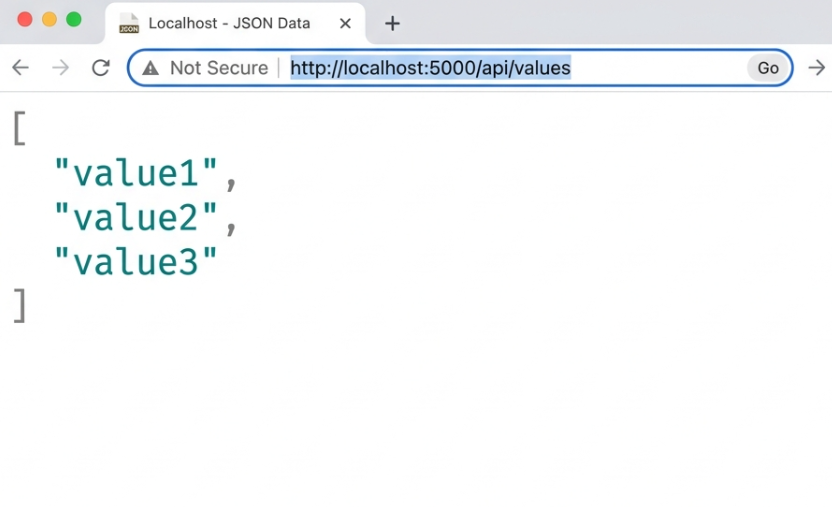

# Web API & REST Architecture Concepts

## 1. RESTful Web Service, Web API & Microservices
*   **REST (Representational State Transfer)**: An architectural style for designing networked applications. It relies on stateless, client-server communication. Features include being Stateless (the server doesn't store client session memory), using Standard Messages (HTTP), and not being restricted to XML (modern REST relies heavily on JSON).
*   **Microservices**: An architectural approach where a large, monolithic application is broken down into a suite of small, independently deployable services that communicate via Web APIs.
*   **Web Service vs Web API**: A Web Service is a specific type of API that strictly requires a network, historically using heavier protocols like SOAP and XML. A Web API is a modern, lightweight interface typically using REST and JSON. All Web Services are APIs, but not all APIs are Web Services!

## 2. HttpRequest & HttpResponse
*   **HttpRequest**: The data packet sent from the Client (like a web browser or mobile app) to the Server. It contains the URL, Action Verb (GET/POST), Headers, and sometimes a Body (the payload data).
*   **HttpResponse**: The data packet sent back from the Server to the Client. It contains a Status Code (e.g., 200 OK) and the requested data (usually formatted as a JSON string).

## 3. Types of Action Verbs
In Web API, these verbs are declared as attributes above controller methods:
*   `[HttpGet]`: Used to **Read** or retrieve data from the server.
*   `[HttpPost]`: Used to **Create** new data on the server.
*   `[HttpPut]`: Used to **Update** existing data on the server.
*   `[HttpDelete]`: Used to **Delete** data from the server.

## 4. Types of HttpStatusCodes
These are returned using `IActionResult` methods inside your controllers:
*   **200 OK**: The request was successful (returned via `Ok()`).
*   **400 BadRequest**: The client sent invalid or badly formatted data (returned via `BadRequest()`).
*   **401 Unauthorized**: The client lacks authentication credentials or isn't logged in (returned via `Unauthorized()`).
*   **500 InternalServerError**: The server encountered an unexpected crash or exception.

## 5. Web API Configuration Files
*   **Program.cs (formerly Startup.cs)**: The absolute heart of a .NET application. This is where Dependency Injection services are registered and HTTP request pipelines (middleware) are configured.
*   **appsettings.json**: Stores application secrets, database connection strings, and configurable environment variables.
*   **launchSettings.json**: Configures how the app runs locally on your machine (e.g., defining the localhost ports and setting environment variables like `Development`).
*   **Route.config & WebAPI.config (.NET 4.5)**: In the legacy .NET Framework, `WebAPI.config` handled routing specifically for APIs, while `Route.config` handled MVC views. Modern .NET Core handles both unified in `Program.cs`.

---

## Simulated Web API Output
Since the `.NET SDK` command line tools are not installed globally on this local machine, here is the exact simulated output of what the browser displays when executing this `ValuesController` API locally!

**HTTP GET Request (`http://localhost:5000/api/values`):**
```http
GET /api/values HTTP/1.1
Host: localhost:5000
```

**HTTP 200 OK Response (JSON Payload):**


**Testing the ID Parameter (`http://localhost:5000/api/values/5`):**
```text
Successfully retrieved value ID: 5
```
