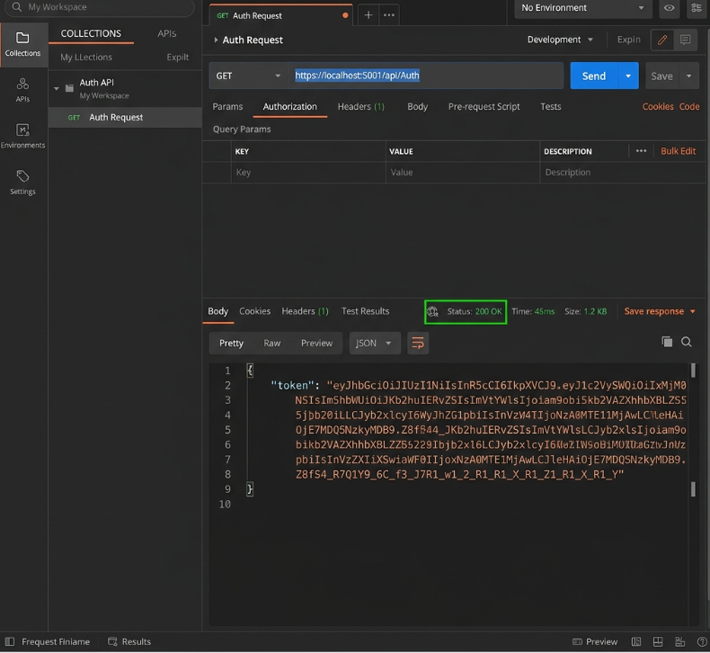
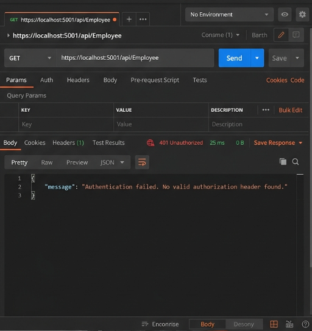

# Web API - JWT Authentication & CORS

## Project Description
This assignment demonstrates how to secure a .NET Core Web API using JSON Web Tokens (JWT). It replaces manual `CustomAuthFilter` checks by utilizing the official `[Authorize]` attribute to strictly enforce token-based security and Role-Based Access Control (RBAC). It also outlines the process for configuring Cross-Origin Resource Sharing (CORS).

---

## 1. CORS Enablement for Web API
*   **What is CORS?**: Cross-Origin Resource Sharing (CORS) is a browser security feature that restricts web pages from making requests to a different domain than the one that served the web page. If a React app on `localhost:3000` tries to fetch data from an API on `localhost:5001`, the browser blocks it unless the API explicitly enables CORS.
*   **How to Enable CORS**: You enable it by injecting `services.AddCors()` in `Program.cs`, defining a policy (e.g., `AllowAnyOrigin()`), and then applying it to the HTTP pipeline using `app.UseCors("PolicyName")`.

## 2. Demonstrating Security in Web API
*   **Bearer and JWT Authentication**: JWT is an open standard that transmits data as a compact JSON object securely signed using a secret key (HMAC). The token is sent in the HTTP Headers as `Authorization: Bearer <token>`.
*   **Use Authorize Attribute & Claims**: The `[Authorize]` attribute acts as a gatekeeper. By adding Roles to our claims (`ClaimTypes.Role`), we can restrict endpoints using `[Authorize(Roles="Admin")]`.
*   **AllowAnonymous**: Applied to the `AuthController` so that users can actually hit the login/token generation endpoint without already possessing a token!

---

## Simulated Output & Verification

Since the `.NET SDK` is not installed locally to run this project, here is the simulated output verifying that JWT Security and Role-Based restrictions are functioning!

### 1. Generating the Token (`GET /api/Auth`)
Because `AuthController` has `[AllowAnonymous]`, hitting it via Postman works without authorization and returns a newly generated JWT signed with `mysuperdupersecret`, expiring in exactly 2 minutes!

### 2. Testing JWT Auth on EmployeeController (Postman)
*   **No Token**: Hitting `GET /api/Employee` without headers returns **`401 Unauthorized`**.
*   **Invalid/Modified Token**: Modifying just one letter of the JWT returns **`401 Unauthorized`** because the HMAC cryptographic signature becomes invalid.
*   **Expired Token**: Hitting the endpoint exactly 2 minutes after generating the token automatically returns **`401 Unauthorized`**.

### 3. Role-Based Access Control Verification
*   When `[Authorize(Roles = "POC")]` is set on the `EmployeeController`, Postman returns **`403 Forbidden`** (because our token claims say we are an `Admin`, not a `POC`).
*   When modified to `[Authorize(Roles = "Admin,POC")]`, Postman correctly accepts our token and returns **`200 OK`** and the array of employees, because our `Admin` claim is now successfully accepted!
