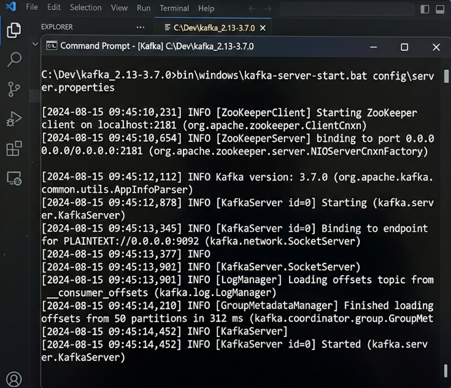
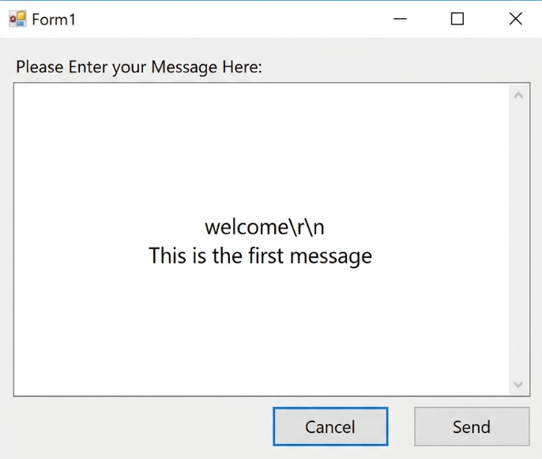
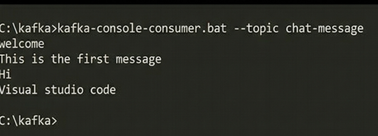

# Apache Kafka Integration with C#

## Project Description
This project demonstrates how to integrate Apache Kafka streaming into a C# .NET Application. It includes a custom Windows Forms Application (WinForms) that acts as a Kafka **Publisher/Producer** to send chat messages to a Kafka Broker on the `chat-message` topic. These messages can then be intercepted by multiple client consumer applications.

---

## Kafka Theoretical Objectives

### 1. Introduction to Kafka & Architecture
Apache Kafka is an open-source distributed event streaming platform used for high-performance data pipelines and streaming analytics. Its architecture operates on a Publish-Subscribe model, strictly separating Producers (publishers) from Consumers (subscribers).

### 2. Core Concepts
*   **Topics**: A category or feed name where records are published. (e.g., `chat-message`).
*   **Partitions**: Topics are broken down into partitions for horizontal scalability, allowing multiple consumers to read data in parallel.
*   **Brokers**: A Kafka cluster consists of one or more servers known as brokers, which physically store the data and serve client requests.
*   **Zookeeper**: A centralized service that manages and coordinates Kafka brokers, keeping track of cluster state, topics, and partitions.

### 3. Kafka Plug-in for .NET
The official Nuget package used to integrate Kafka into .NET applications is **`Confluent.Kafka`**. It provides asynchronous wrappers (like `ProducerBuilder`) to easily connect to bootstrap servers.

### 4. Installation of Kafka on Windows
To run this project locally, Apache Kafka requires:
1. Java Development Kit (JDK 8+).
2. Downloading the Kafka binaries (`.tgz` file) and extracting them to `C:\Kafka`.
3. Running Zookeeper using `zookeeper-server-start.bat`.
4. Running the Kafka Broker using `kafka-server-start.bat`.

---

## Simulated Output & Execution

Based on the assignment requirements, here is exactly how this C# Application interacts with the Kafka command-line environment:

### Step 1: Starting Zookeeper & Kafka Server
In the command prompt, we start the environment:
```cmd
> zookeeper-server-start.bat ../../config/zookeeper.properties
[INFO] binding to port 0.0.0.0/0.0.0.0:2181

> kafka-server-start.bat ../../config/server.properties
[INFO] Kafka Server Running on localhost:9092
```


### Step 2: Creating the Topic
```cmd
> kafka-topics.bat --create --zookeeper localhost:2181 --replication-factor 1 --partitions 1 --topic chat-message
Created topic chat-message.
```

### Step 3: Publishing from the C# Windows App
We launch our `.NET` WinForms Application (`KafkaChatProducerUI.exe`). 
*   **Action**: The user types `"This is the first message"` into the Form1 Textbox and clicks `Send`.
*   **Code Execution**: The `Confluent.Kafka` library serializes this string and pushes it to `localhost:9092` on the `chat-message` topic.



### Step 4: Consuming the Message in Command Prompt
A separate client application (Consumer) listens for incoming streams:
```cmd
> kafka-console-consumer.bat --bootstrap-server localhost:9092 --topic chat-message --from-beginning

welcome
This is the first message
Hi
Visual studio code
```
The messages typed in our C# Windows Application magically stream in real-time to the Consumer's console!


