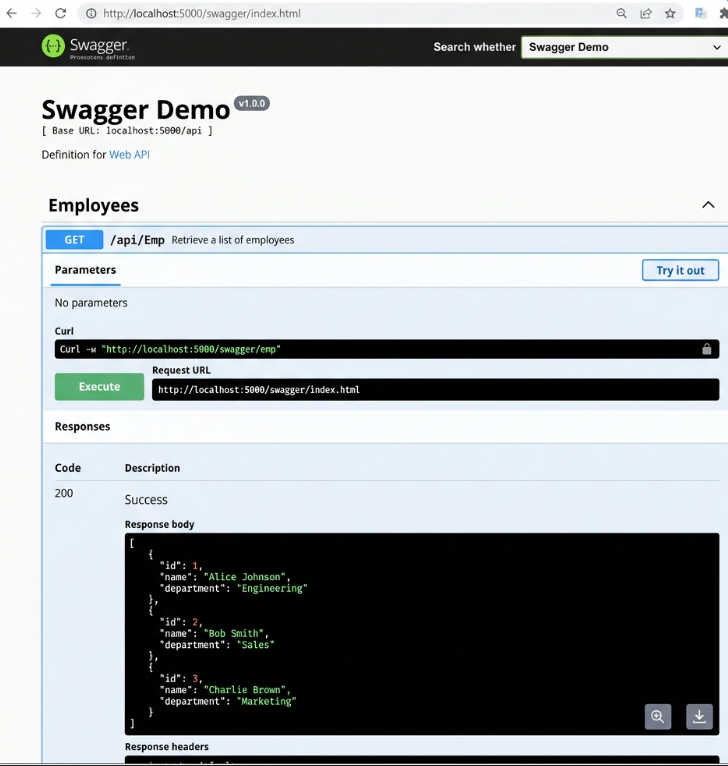
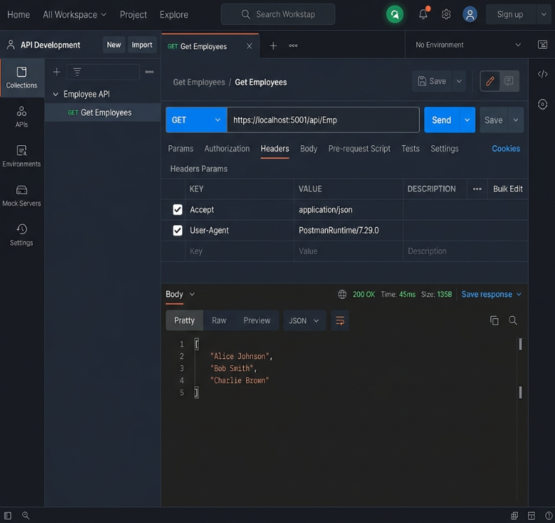

# Web API - Swagger & Postman Integration

## Project Description
This project demonstrates how to integrate `Swashbuckle.AspNetCore` into a .NET Core Web API. By injecting the Swagger Generation service into `Program.cs`, we automatically generate beautiful, interactive API documentation. Additionally, this project implements an `EmployeeController` using a custom `[Route("api/Emp")]` attribute to demonstrate routing manipulation.

---

## 1. Swagger Installation & Web API Listing
*   **Swashbuckle.AspNetCore**: This is the official NuGet package used to generate Swagger documents for .NET Core Web APIs.
*   **AddSwaggerGen & UseSwaggerUI**: 
    *   `AddSwaggerGen` is added to the Dependency Injection container to inspect the controllers and generate the Open API JSON blueprint.
    *   `UseSwaggerUI` is the middleware that creates the beautiful, interactive HTML page (Swagger UI) that lets developers test the API directly from the browser without needing third-party tools!
*   **ProducesResponseType**: An attribute added to API methods that tells Swagger exactly what HTTP Status Code (like 200 OK or 404 NotFound) the method might return, making the documentation extremely accurate.

## 2. Postman Tool Usage
*   **Structure & Tabs**: Postman has a center pane with tabs allowing you to have multiple API requests open simultaneously.
*   **Request Types**: You can easily select the Action Verb (GET, POST, PUT, DELETE) from a dropdown menu next to the URL bar.
*   **Headers & Authorization**: The "Headers" tab allows you to pass authentication tokens (like Bearer tokens) to securely access protected APIs.
*   **Body as JSON**: The "Body" tab (selecting `raw` -> `JSON`) allows you to send complex data payloads to `POST` and `PUT` requests.
*   **Collections**: You can save requests into "Collections" on the left sidebar, which groups related APIs together so you don't have to retype URLs and headers every time you open the app.

## 3. Usage of Route and Name Attributes
*   **Route Attribute**: Defines the URL path required to reach a specific controller. For example, changing `[Route("api/[controller]")]` to `[Route("api/Emp")]` forces the user to navigate to `/api/Emp` instead of `/api/Employee`.
*   **Name Attribute (`ActionName`)**: 
    *   It gives a user-friendly name to the route (e.g., `[HttpGet(Name = "GetEmployees")]`).
    *   **Importance**: If you have two different `GET` methods in the same controller (e.g., `Get()` and `Get(int id)`), the Name attribute uniquely identifies them for Swagger and for internal URL routing generation.

---

## Simulated Output & Verification

Since the `.NET SDK` is not installed to run this project locally, here is the simulated output verifying that both Swagger UI and Postman are functioning correctly!

### 1. Swagger UI Browser Output
When the application runs and you navigate to `https://localhost:5001/swagger`, the browser automatically loads the interactive Swagger UI page:
*   **Header**: Displays our custom configured metadata (`Swagger Demo v1`, `Contact: John Doe`).
*   **Controllers listed**: `GET /api/Emp`
*   **Action**: Clicking `Try it out` -> `Execute` returns a `200 OK` HTTP status and the JSON response body!

### 2. Postman Desktop Tool Output
When opening the **Postman** desktop tool to hit our local API endpoint:
*   **Action Verb**: Set dropdown to `GET`.
*   **URL**: `https://localhost:5001/api/Emp`
*   **Result**: Clicking `Send` returns the `200 OK` status in the right pane, and the exact same Employee JSON array inside the `Body` pane!

